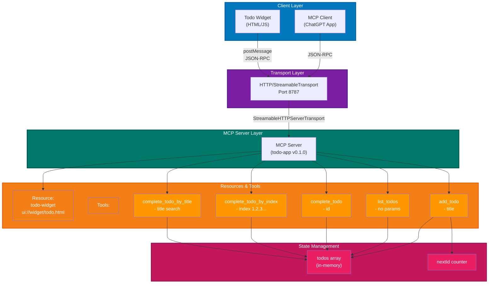
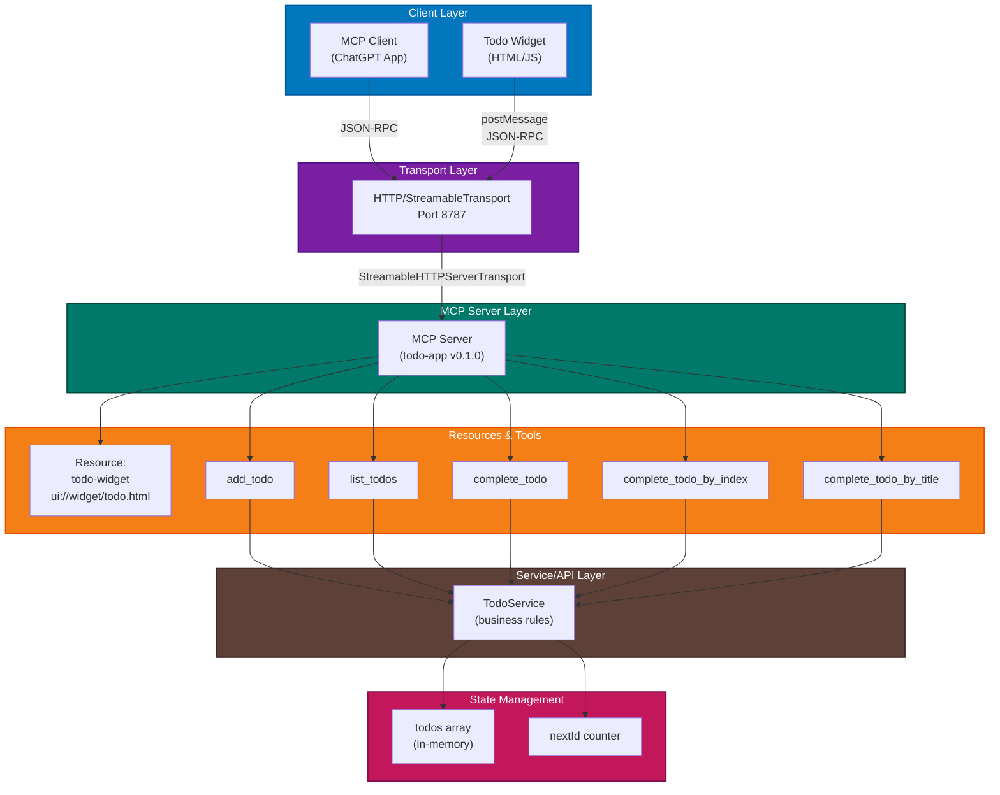

# chatgpt.app.quickstart

Following [chatgpt quick start](https://developers.openai.com/apps-sdk/quickstart/).

Looks good [mcpjam](https://www.mcpjam.com/).

Good medium blogs:

- [Start building your first ChatGPT app](https://medium.com/@kenzic/getting-started-building-your-first-chatgpt-app-a3ab54d45f23)
## Architecture

## Architecture (with Service/API Layer)

> **Tip:** Install the [Markdown Preview Mermaid Support](https://marketplace.visualstudio.com/items?itemName=bierner.markdown-mermaid) extension to render Mermaid diagrams in VS Code's markdown preview.

### Components

- **Client Layer**: MCP client (ChatGPT App) and interactive todo widget
- **Transport**: HTTP server on port 8787 using StreamableTransport for MCP communication
- **MCP Server**: Serves resources and tools following the Model Context Protocol
- **Resource**: Interactive todo widget UI served at `ui://widget/todo.html`
- **Tools** (5 available):
  - `add_todo` - Add a new todo with a title
  - `list_todos` - List all todos with IDs and completion status
  - `complete_todo` - Complete a todo by ID
  - `complete_todo_by_index` - Complete a todo by position (1, 2, 3...)
  - `complete_todo_by_title` - Complete a todo by searching title
- **State**: In-memory todos array and ID counter (stored in memory)