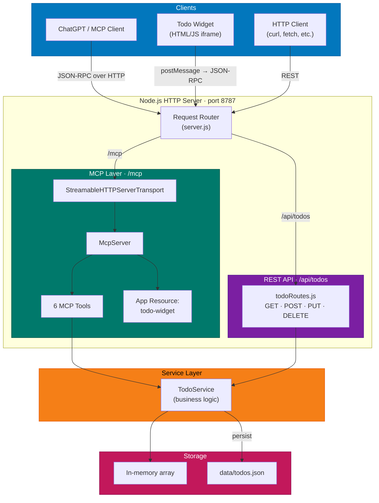

# Todo MCP Server

A template todo application that demonstrates how to build a [Model Context Protocol (MCP)](https://modelcontextprotocol.io/) server with an interactive UI widget for [ChatGPT Apps](https://developers.openai.com/apps-sdk/quickstart/).

The server exposes a todo list through both **MCP tools** (for AI assistants) and a **REST API** (for direct HTTP access), backed by a shared service layer and JSON file persistence.

## Quick Start

```bash
# Install dependencies
npm install

# Start the server
node server.js
```

The server starts at **http://localhost:8787** with:

- MCP endpoint: `http://localhost:8787/mcp`
- REST API: `http://localhost:8787/api/todos`

### Try the API

```bash
# List todos
curl http://localhost:8787/api/todos

# Add a todo
curl -X POST http://localhost:8787/api/todos \
  -H 'Content-Type: application/json' \
  -d '{"title": "Buy groceries"}'

# Complete a todo
curl -X PUT http://localhost:8787/api/todos/todo-1

# Delete a todo
curl -X DELETE http://localhost:8787/api/todos/todo-1
```

### Environment Variables

| Variable | Default | Description |
|----------|---------|-------------|
| `PORT` | `8787` | Server listen port |
| `TODO_DATA_FILE` | `data/todos.json` | Path to the todo data file |

## Architecture



### MCP Tools

| Tool | Description | Input |
|------|-------------|-------|
| `add_todo` | Create a new todo | `title` (string) |
| `list_todos` | List all todos with summary | *(none)* |
| `complete_todo` | Complete by ID | `id` (string) |
| `complete_todo_by_index` | Complete by position (1-based) | `index` (integer) |
| `complete_todo_by_title` | Complete by title search | `title` (string) |
| `delete_completed` | Remove all completed todos | *(none)* |

### Project Structure

```
├── server.js                 # HTTP server & request routing
├── mcp/
│   └── todoTools.js          # MCP tool & resource registration
├── routes/
│   └── todoRoutes.js         # REST API route handlers
├── services/
│   └── todoService.js        # Business logic & persistence
├── public/
│   └── todo-widget.html      # Interactive todo widget (HTML/JS)
├── data/
│   └── todos.json            # Persisted data (gitignored)
└── docs/
    ├── architecture.md       # Detailed architecture documentation
    ├── api-reference.md      # REST API reference
    ├── mcp-tools.md          # MCP tools reference
    └── contributing.md       # Contributing guidelines
```

## Debugging & Testing

### MCP Inspector

Use [MCP Inspector](https://github.com/modelcontextprotocol/inspector) to test MCP tools interactively:

```bash
npx @modelcontextprotocol/inspector
```

### mcpjam

[mcpjam](https://www.mcpjam.com/) provides tools for debugging and testing MCP servers during development.

```bash
npx @mcpjam/inspector@latest
```

### curl

Test the REST API directly — see the [API Reference](docs/api-reference.md) for all endpoints.

## Documentation

| Document | Description |
|----------|-------------|
| [OpenAPI Specification](docs/openapi.yaml) | Machine-readable REST API specification (OpenAPI 3.0.0) |
| [API Reference](docs/api-reference.md) | REST API endpoints, request/response shapes |
| [API Compliance Report](docs/API_COMPLIANCE.md) | Validation that implementation adheres to OpenAPI spec |
| [Architecture](docs/architecture.md) | System design, layers, and design decisions |
| [MCP Tools](docs/mcp-tools.md) | MCP tool definitions, inputs, and transport details |
| [Contributing](docs/contributing.md) | Code standards, commit conventions, and setup |

## References

- [ChatGPT Apps SDK Quick Start](https://developers.openai.com/apps-sdk/quickstart/) — official guide for building ChatGPT apps
- [Model Context Protocol](https://modelcontextprotocol.io/) — the MCP specification
- [MCP TypeScript SDK](https://github.com/modelcontextprotocol/typescript-sdk) — `@modelcontextprotocol/sdk` package
- [MCP Apps Extension](https://github.com/nicholasgriffintn/mcp-apps) — `@modelcontextprotocol/ext-apps` for widget resources
- [MCP Inspector](https://github.com/modelcontextprotocol/inspector) — interactive MCP testing tool
- [mcpjam](https://www.mcpjam.com/) — MCP development and debugging tools
- [Zod](https://zod.dev/) — TypeScript-first schema validation
- [Start building your first ChatGPT app](https://medium.com/@kenzic/getting-started-building-your-first-chatgpt-app-a3ab54d45f23) — step-by-step tutorial
- [Conventional Commits](https://www.conventionalcommits.org/) — commit message specification