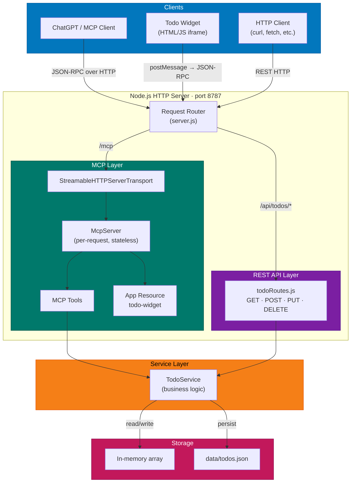

# Architecture

This document describes the architecture of the Todo MCP Server — a template application demonstrating how to build a [Model Context Protocol](https://modelcontextprotocol.io/) server with a REST API and an interactive UI widget.

## Overview

The server exposes two interfaces for the same underlying todo data:

- **MCP endpoint** (`/mcp`) — used by ChatGPT (or any MCP client) to call tools via JSON-RPC
- **REST API** (`/api/todos`) — standard HTTP/JSON for direct integrations or testing

Both interfaces share a single `TodoService` instance, ensuring consistent state.

## Diagram



## Layers

### Client Layer

| Client | Transport | Description |
|--------|-----------|-------------|
| ChatGPT / MCP Client | JSON-RPC over HTTP POST to `/mcp` | Calls MCP tools like `add_todo`, `list_todos` |
| Todo Widget | `postMessage` JSON-RPC (iframe bridge) | Interactive HTML UI embedded in ChatGPT |
| HTTP Client | Standard REST calls to `/api/todos` | curl, fetch, Postman, etc. |

### Server Layer (`server.js`)

The HTTP server routes requests to the appropriate handler:

- **`/mcp`** → Creates an `McpServer` + `StreamableHTTPServerTransport` per request (stateless mode, since `McpServer` only supports one transport connection at a time)
- **`/api/todos/*`** → REST route handler
- **`/`** → Health check
- **`OPTIONS`** → CORS preflight

### MCP Layer (`mcp/todoTools.js`)

Registers 6 tools and 1 app resource on the MCP server using the `@modelcontextprotocol/sdk` and `@modelcontextprotocol/ext-apps` packages. Tools call `TodoService` methods directly — no intermediate HTTP simulation.

### REST API Layer (`routes/todoRoutes.js`)

Standard CRUD routes with JSON request/response. Includes a 1 MB body size limit. See [API Reference](api-reference.md) for details.

### Service Layer (`services/todoService.js`)

`TodoService` encapsulates all business logic:

- Manages the in-memory todo array and auto-incrementing ID counter
- Persists state to `data/todos.json` using atomic save (write to disk before updating memory)
- Provides methods: `list()`, `add()`, `completeById()`, `completeByIndex()`, `completeByTitle()`, `deleteById()`, `deleteCompleted()`

### Storage

- **In-memory**: Array of todo objects + `nextId` counter for fast reads
- **Disk**: `data/todos.json` — JSON file written on every mutation using the atomic save pattern (disk write succeeds before in-memory state is updated)

## Project Structure

```
├── server.js                 # HTTP server, request routing
├── mcp/
│   └── todoTools.js          # MCP tool & resource registration
├── routes/
│   └── todoRoutes.js         # REST API route handlers
├── services/
│   └── todoService.js        # Business logic & persistence
├── public/
│   └── todo-widget.html      # Interactive UI widget (HTML/JS)
├── data/
│   └── todos.json            # Persisted todo data (gitignored)
├── docs/                     # Documentation
│   ├── architecture.md       # This file
│   ├── api-reference.md      # REST API reference
│   ├── mcp-tools.md          # MCP tools reference
│   └── contributing.md       # Contributing guidelines
├── agents.md                 # AI agent directives
├── package.json
└── README.md
```

## Key Design Decisions

| Decision | Rationale |
|----------|-----------|
| MCP tools call `TodoService` directly | Avoids duplicating validation logic between REST and MCP layers |
| Per-request `McpServer` instance | `McpServer` only supports one transport at a time; stateless mode requires this |
| Atomic save (write-then-assign) | Prevents in-memory/disk divergence if `writeFile` fails |
| Zod schemas for MCP input validation | SDK validates inputs before tool handlers run; no redundant manual checks |
| No framework (raw `node:http`) | Keeps template minimal with zero framework dependencies |
| Body size limit (1 MB) | Prevents memory exhaustion from oversized payloads |
